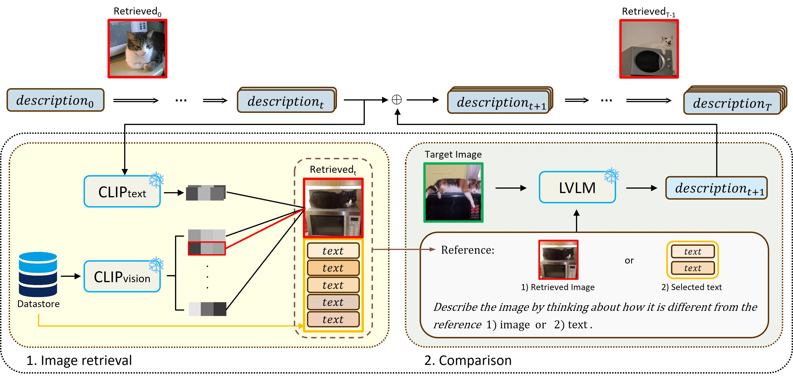

# ReCoD: Enhancing Image Description for Cross-Modal Understanding via Retrieval and Comparison Feedback Mechanism

> Official PyTorch implementation of "ReCoD: Enhancing Image Description for Cross-Modal Understanding via Retrieval and Comparison Feedback Mechanism"
> > [Geunyoung Jung](https://gyjung975.github.io/), Jun Park, Hankyeol Lee, [Kyungwoo Song](https://scholar.google.com/citations?user=HWxRii4AAAAJ&hl=ko), [Jiyoung Jung ](https://rcv.uos.ac.kr/)

## Abstract

> To effectively utilize the large language models (LLMs) in the vision domain, it is essential to establish a strong connection between the visual and textual modalities. While deep embeddings can facilitate this connection, representing images as detailed textual descriptions offers significant advantages in terms of the usability and interpretability inherent in natural language. In this paper, we introduce a method of image description enhancement designed to generate highly detailed descriptions that include discriminative attributes of the given image, without requiring additional training. Our method, \textsc{ReCoD}, consists of two main components: 1) \textit{“image retrieval”}, which retrieves the image most similar to the descriptions of the target image, and 2) \textit{“comparison”}, which identifies and describes the differences between the target image and the retrieved image. These two components are complementary and form an iterative feedback mechanism. As this process iterates, the retrieved image becomes visually closer to the target image, and the descriptions become progressively more informative. Extensive experiments demonstrate the effectiveness of bridging the gap between the two modalities and the quality of our enhanced descriptions.
