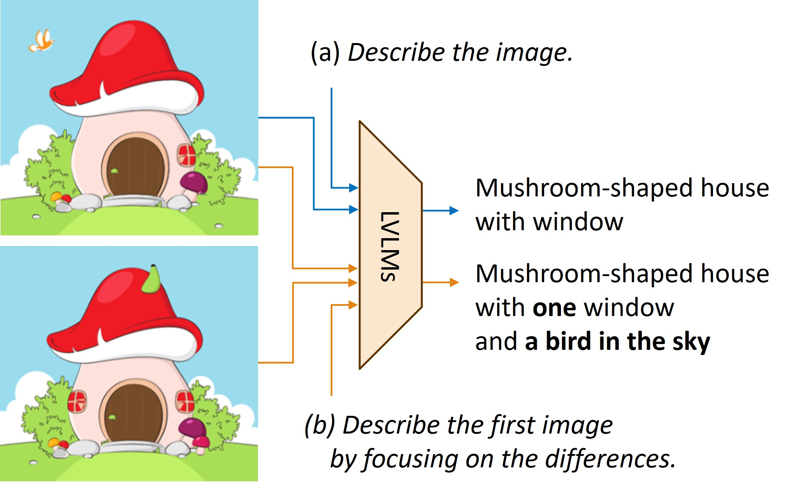

# ReCoD: Enhancing Image Description for Cross-Modal Understanding via Retrieval and Comparison Feedback Mechanism
<p align="center">

</p>

> Official PyTorch implementation of "ReCoD: Enhancing Image Description for Cross-Modal Understanding via Retrieval and Comparison Feedback Mechanism"
> > [Geunyoung Jung](https://gyjung975.github.io/), Jun Park, Hankyeol Lee, [Kyungwoo Song](https://scholar.google.com/citations?user=HWxRii4AAAAJ&hl=ko), [Jiyoung Jung ](https://rcv.uos.ac.kr/)

## Abstract
<p align="center">

</p>

> To effectively utilize the large language models (LLMs) in the vision domain, it is essential to establish a strong connection between the visual and textual modalities. While deep embeddings can facilitate this connection, representing images as detailed textual descriptions offers significant advantages in terms of the usability and interpretability inherent in natural language. In this paper, we introduce a method of image description enhancement designed to generate highly detailed descriptions that include discriminative attributes of the given image, without requiring additional training. Our method, \textsc{ReCoD}, consists of two main components: 1) \textit{“image retrieval”}, which retrieves the image most similar to the descriptions of the target image, and 2) \textit{“comparison”}, which identifies and describes the differences between the target image and the retrieved image. These two components are complementary and form an iterative feedback mechanism. As this process iterates, the retrieved image becomes visually closer to the target image, and the descriptions become progressively more informative. Extensive experiments demonstrate the effectiveness of bridging the gap between the two modalities and the quality of our enhanced descriptions.

## Setup
```shell
git clone https://github.com/gyjung975/ReCoD.git
cd ReCoD

conda create -n recod python=3.8 -y
conda activate recod

conda install pytorch==1.12.1 torchvision==0.13.1 torchaudio==0.12.1 cudatoolkit=11.3 -c pytorch -y

pip install -r requirements.txt
pip install git+https://github.com/openai/CLIP.git
```

## Dataset
* Download 2 datasets [OK-VQA](https://okvqa.allenai.org/) and [A-OKVQA](https://github.com/allenai/aokvqa) under `data/`.
  * Both datasets are based on [COCO](https://cocodataset.org/#home).

## Datastore preparation
* First, prepare datastore for each dataset under `features/`.
```shell

```

## Run
* Generate descriptions using LVLMs.
* Each script is set to the default settings we used in our experiments.
* Output descriptions are automatically stored in a format that enables knowledge-based VQA per loop under `diff/`.

### LLaVA-1.5-13B
```shell
# LLaVA w/o ReCoD
python llava_base.py --data_dir <data/path/> --dataset okvqa
# LLaVA w/ ReCoD (text-based)
python llava_recod.py --data_dir <data/path/> --dataset okvqa
```
### Claude3 (Haiku)
* Need Claude API key
```shell
# Claude w/o ReCoD
python claude_base.py --data_dir <data/path/> --dataset okvqa
# Claude w/ ReCoD (text-based)
python claude_recod.py --data_dir <data/path/> --dataset okvqa
# Claude w/ ReCoD (image-based)
python claude_recod_img.py --data_dir <data/path/> --dataset okvqa
```

## Eval
**To construct in-context prompts, naive descriptions of the training data need to be generated by baseline LVLMs.**

We conduct knowledge-based VQA at [PICa](https://github.com/microsoft/PICa).
* GPT API key is required, but you can use other open source LLMs.

Evaluating is done at [VQA](https://github.com/GT-Vision-Lab/VQA) and [A-OKVQA](https://github.com/allenai/aokvqa), respectively.
